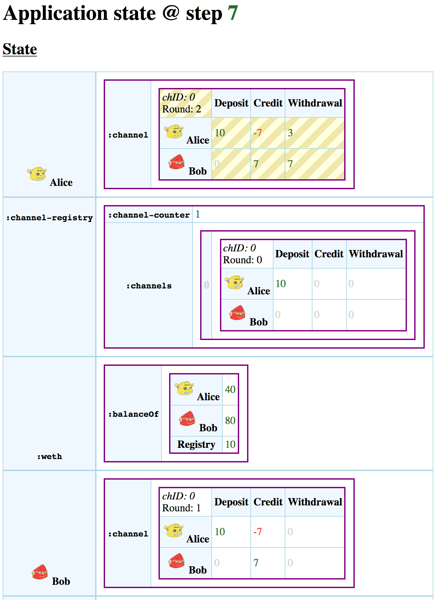

# ClojureScript ABI Viewer

Prerequisite on both macOS and Linux:
- [Nix 2.0](https://nixos.org/nix/) package manager

## Usage

```
nix-shell
clj -A:build-dev
```

## Motivation

This project was an exploration of what's possible with modern
[Clojure CLI tooling](http://clojure.org/guides/deps_and_cli)
if we want to use ClojureScript for developing a webpage.

While it's important to keep dependencies to a minimum,
having a hot-reloading development webserver is a must
for exploratory, prototyping work.

[Figwheel](https://www.youtube.com/watch?v=j-kj2qwJa_E) is a
wellknown tool, which can provide such a workflow with a
tight feedback loop.

Figwheel required quite a heavy tooling around it in the past,
but it has been simplified lately, by factoring its core out.
The result is called
[`figwheel.main`](https://github.com/bhauman/figwheel-main).
It doesn't require Leiningen anymore and works well with `clj`.

I was trying to use https://cycle.js.org as a UI framework,
but the various module systems in its transitive dependencies,
just doesn't play well with the Google Closure compiler's new
ES6, AMD and CommonJS support.

Cycle.js also has an amazing story for testing using a
[virtual time driver](https://www.npmjs.com/package/@cycle/time),
so maybe it should be ported to ClojureScript, since it works with
different stream libraries.

As a result I used no UI libraries, just vanilla ClojureScript and built up
a minimal, *non-reactive* version of [Hoplon](http://hoplon.io), since I want
to be able to visualize data _at least_, even without interactivity.

I little benchmark showed it's possible to render 3 smart contracts
(equivalent of ~12kB HTML) 1000 times in about 2 seconds:

```
(time (log "Many apps" (doall (repeatedly 1000 app))))
```

It means we can use this approach for smaller apps and just
regenerate the whole DOM, or big parts of it, a few times a second,
on every change in the underlying data model.

This opens up the possibility to create vastly simpler
interactive application architecture than what we see with
[React](https://reactjs.org) or [Vue.js](https://vuejs.org).

For that we would need some stream library though.

We have already explored [RxJS](https://github.com/ReactiveX/rxjs),
but with its hot, cold and lukewarm observers are just too much
mental overhead.

[xstream](https://github.com/staltz/xstream)  was made for
Cycle.js, but some of the issues with Cycle came from xstream.

[Bacon.js](https://baconjs.github.io) has comprehensive documentation and the
community produced a lot of examples, but it's been superceeded by
[Kefir.js](https://kefirjs.github.io/kefir/).

The most promising one is the new kid on the block: [Highland.js](https://highlandjs.org).

## `resources/public/net/4/*.json`

Just some real-world ABI examples, taken from:
https://gitlab.com/oax/dex-poc/tree/master/dex/net/4

## `cljs.dom` namespace

It provides simple Clojure functions to wrap the verbose, imperative
DOM API methods.

## The main namespace: `abi.viewer`

The main application which `figwheel` is going to refresh, along with the
styles in `./resources/public/app.css`.

## Example screenshot


