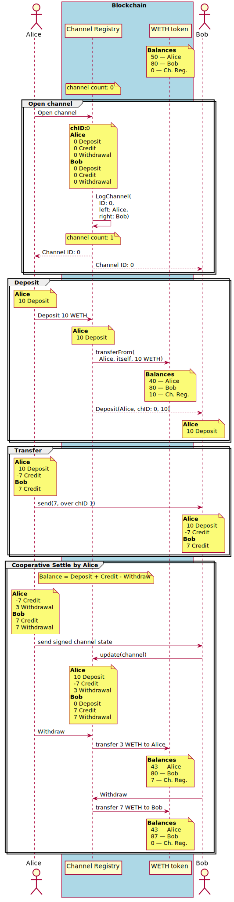

# State-channel system state-history viewer

Prerequisite on both macOS and Linux:
- [Nix 2.0](https://nixos.org/nix/) package manager

## Start

```
nix-shell
npm install
clojure -A:dev
```

## Motivation

See under the
[README.md](https://github.com/enumatech/cljs-abi-viewer/blob/master/README.md)
in the `master` branch.

## The main `history.viewer` namespace

This is the main application which `figwheel` loads and refreshes automatically,
along with the styles in `./resources/public/app.css`.

You can use `Shift-Left` and  `Shift-Right` to navigate between application states.

## Example screenshot


## Unconditional cooperative payment sequence


